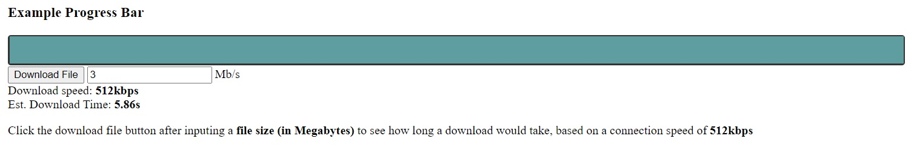

# JavaScript-ProgressBar
A simple progress bar created using HTML, CSS and JavaScript. The progress bar loads from 0 - 100% based on a download speed of 512 kbps versus the size of the file(in Megabytes) to be downloaded.


# [Live Demo Link](https://raw.githack.com/Aaron-RN/JavaScript-ProgressBar/development/index.html)

Uses the animate() method, a built in JavaScript element related function.
```var animation = element.animate(keyframes, options);```

### Code Snippet

```
const progressBar = document.querySelector('.progressBar');

// keyframe animations
const animProgressLoader = [
  { width: '0' }, // from 0%
  { width: '100%' }, // to 100%
];

progressBar.animate(animProgressLoader, { 
  // timing options
  duration: timeToComplete,
  easing: 'ease-out',
  iterations: 1,
  fill: 'forwards',
});
```